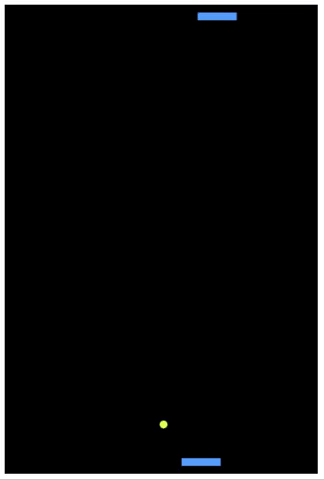
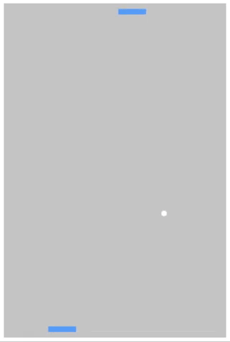

# Pong-AI

Small project that I've been working on to learn more about applications of AI. 

 ### Version 1 
 
 

 ### Version 2
 
 


## AI-Overview

  The pong AI was created using a Neural Network consisting of 4 dense layers.
  ```
  const model = tf.sequential();
  model.add(tf.layers.dense({units: 256, inputShape: [8]})); 
  model.add(tf.layers.dense({units: 512, inputShape: [256]}));
  model.add(tf.layers.dense({units: 256, inputShape: [512]}));
  model.add(tf.layers.dense({units: 3, inputShape: [256]}));
  ```
  The first layer takes in 8 data points to train the model:
  
   1.  Player Paddle Location 
   2.  Computer Paddle Location 
   3.  Ball x coordinate
   4.  Ball y coordinate
   5.  Previous Ball x coordinate
   6.  Previous Ball y coordinate
   7.  Previous Player Paddle Location
   8.  Previous Computer Paddle Location
   
   The forth and final layer outputs 3 data points that determines if the paddle goes left,right or stays in the same location.
  
### Version 1: 

  In Version 1, the AI is trained by collecting data from a human player against a simple computer algorithm which essentially tries to keep the ball aligned with it's paddle at all times for 15 rounds. This is a very small amount of training data, and as a result the AI doesn’t perform very well.
  
### Version 2: 

In Version 2

## Acknowledgments

* Big thanks to @Sentdex for his ML videos
